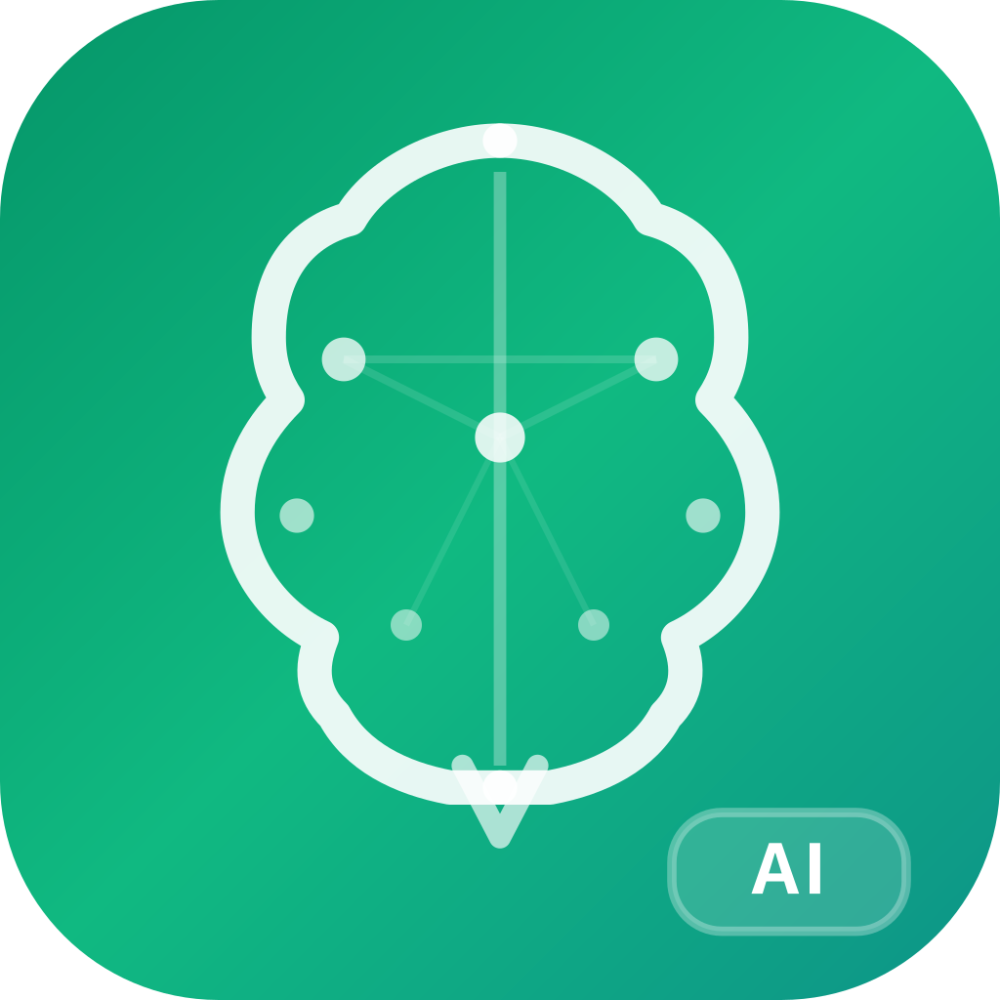
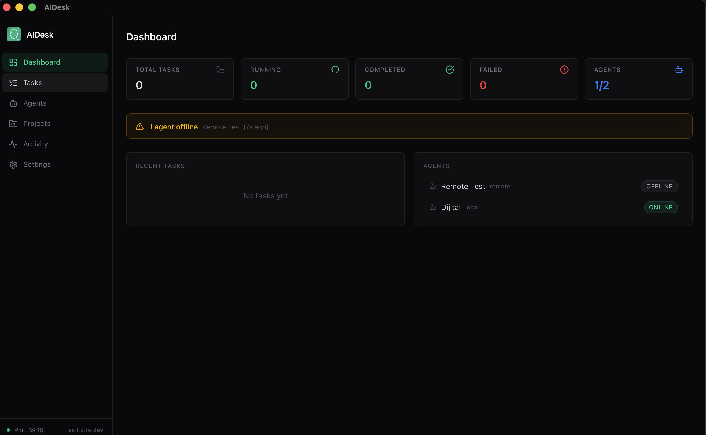

<p align="center">
  
</p>

<h1 align="center">AIDesk</h1>
<p align="center"><strong>Claude Code Agent Control Panel</strong></p>

<p align="center">
  <a href="https://www.npmjs.com/package/aidesk-agent"></a>
  
  
  
  <a href="LICENSE"></a>
</p>

<p align="center">
  <a href="#what-is-aidesk">English</a> · <a href="README_TR.md">Türkçe</a> · <a href="https://unkownpr.github.io/AIDesk/">Website</a>
</p>

<p align="center">
  
</p>

---

## What is AIDesk?

AIDesk is a native desktop application for managing multiple Claude Code AI agents from a single control panel. Built with **Tauri v2** (Rust) and **React**, it provides a fast, secure, and lightweight interface to create tasks, assign them to agents, and monitor execution in real time.

Agents can run **locally** on the same machine or **remotely** on any server via the [`aidesk-agent`](https://www.npmjs.com/package/aidesk-agent) npm package.

## Features

- **Multi-Agent Management** — Create and manage local + remote Claude Code agents
- **Task Queue & Priorities** — Create tasks with priority levels (critical / high / medium / low)
- **Real-Time Log Streaming** — SSE-based live log output from running agents
- **Remote Agents** — Connect agents from any machine with `npx aidesk-agent`
- **Project Management** — Link tasks to project directories for context-aware execution
- **Encrypted Vault** — Store API keys and secrets with AES-256-GCM encryption
- **MCP & Git Config** — Configure MCP servers and git repositories per agent
- **Activity Logging** — Full audit trail for all operations
- **Native Notifications** — macOS notifications for task completion, failure, and agent status
- **Dark / Light Theme** — System-aware theme with manual toggle
- **Dashboard** — Overview of agent statuses, task distribution, and offline warnings

## Architecture

```
┌───────────────────────────────────────────────────────────┐
│                    AIDesk Desktop App                      │
│                                                           │
│  ┌─────────────────┐       ┌───────────────────────────┐  │
│  │  React Frontend  │       │     Tauri v2 (Rust)       │  │
│  │                  │       │                           │  │
│  │  Dashboard       │       │  ┌─────────────────────┐  │  │
│  │  Tasks           │  IPC  │  │  Axum HTTP :3939    │  │  │
│  │  Agents          │◄─────►│  ├─────────────────────┤  │  │
│  │  Activity        │       │  │  SQLite (WAL)       │  │  │
│  │  Settings        │       │  ├─────────────────────┤  │  │
│  │                  │       │  │  Vault (AES-256)    │  │  │
│  │  Tailwind CSS v4 │       │  ├─────────────────────┤  │  │
│  │  Lucide Icons    │       │  │  Orchestrator       │  │  │
│  └─────────────────┘       │  ├─────────────────────┤  │  │
│                             │  │  Agent Runner       │  │  │
│                             │  │  (Node.js sidecar)  │  │  │
│                             │  └─────────────────────┘  │  │
│                             └───────────────────────────┘  │
└─────────────┬──────────────────────────┬──────────────────┘
              │ HTTP API (:3939)          │ stdin/stdout JSON
              ▼                           ▼
     ┌────────────────┐         ┌──────────────────┐
     │  Remote Agent   │         │ Claude Agent SDK │
     │  (aidesk-agent) │         │ (@anthropic-ai)  │
     └────────────────┘         └──────────────────┘
```

## Project Structure

```
aidesk/
├── src-tauri/src/           # Rust backend
│   ├── db/                  #   SQLite models, queries
│   ├── api/                 #   Axum HTTP endpoints
│   ├── agent/               #   SDK sidecar runner
│   ├── orchestrator/        #   Task distribution
│   └── vault/               #   AES-256-GCM encryption
├── agent-runner/            # Node.js sidecar (Claude Agent SDK)
├── aidesk-agent/            # npm package for remote agents
├── src/                     # React frontend
│   ├── pages/               #   Dashboard, Tasks, Agents, Activity, Settings
│   ├── components/          #   UI components
│   ├── hooks/               #   Custom React hooks
│   └── lib/                 #   Tauri bindings, utilities
└── docs/                    # GitHub Pages site
```

## Prerequisites

| Requirement | Version |
|---|---|
| Rust + Cargo | latest stable |
| Node.js | >= 18 |
| pnpm | >= 9 |
| Claude Code | installed and authenticated |

## Installation

```bash
# Clone
git clone https://github.com/unkownpr/AIDesk.git
cd AIDesk

# Install dependencies
pnpm install
cd agent-runner && npm install && cd ..

# Development
cargo tauri dev

# Production build
cargo tauri build
```

## Remote Agent Setup

Remote agents connect over HTTP polling — no WebSocket required, firewall-friendly.

1. Create a **remote** agent in the AIDesk UI and copy its token.
2. On the remote machine:

```bash
# Recommended: token via environment variable
AIDESK_TOKEN=your-token npx aidesk-agent --server https://your-server:3939

# Local network (HTTP)
AIDESK_TOKEN=your-token npx aidesk-agent --server http://192.168.1.5:3939 --insecure
```

The agent will:
- Poll for new task assignments every 3 seconds
- Send heartbeats every 30 seconds
- Stream execution logs back to AIDesk in real time
- Report task results on completion

See [`aidesk-agent` on npm](https://www.npmjs.com/package/aidesk-agent) for all options.

## API Endpoints

The Axum HTTP server runs on port **3939**:

| Method | Endpoint | Auth | Description |
|---|---|---|---|
| `GET` | `/api/agent/poll` | Agent token | Poll for assigned tasks |
| `POST` | `/api/agent/heartbeat` | Agent token | Send heartbeat signal |
| `POST` | `/api/agent/report` | Agent token | Report task result |
| `POST` | `/api/agent/log` | Agent token | Send progress log entry |
| `GET` | `/api/tasks/{id}/logs/stream` | Dashboard key | SSE real-time log stream |
| `GET` | `/api/health` | None | Health check |

## License

[MIT](LICENSE)

---

<p align="center">
  Built by <a href="https://ssilistre.dev">ssilistre.dev</a>
</p>
